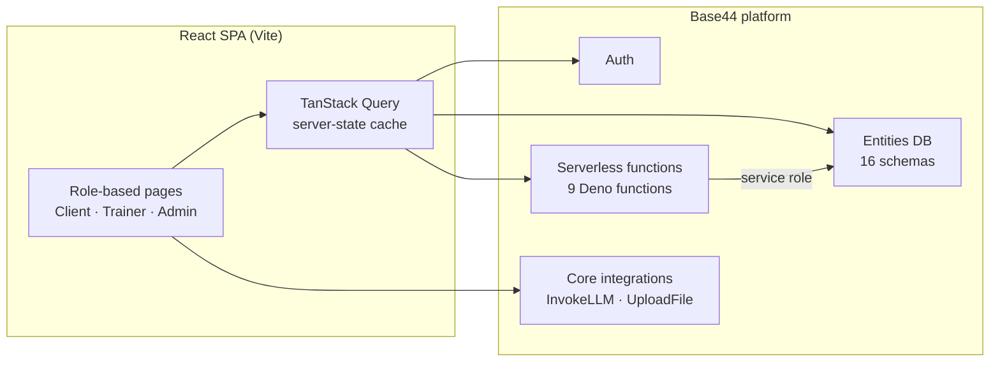

<div align="center">

# 🏋️ EJT Fitness

**An agency platform EJT Fitness uses to manage its trainers and clients.**


</div>

---

A fitness agency platform in production use by EJT Fitness to manage
**2 trainers and 32 clients**.

## 📑 Table of Contents

- [Architecture](#️-architecture)
- [Design Decisions](#-design-decisions)
- [Challenges](#-challenges)
- [Features](#-features)
- [Tech Stack](#-tech-stack)
- [Project Structure](#-project-structure)
- [Getting Started](#-getting-started)

## 🏗️ Architecture



- **Frontend:** a React 18 single-page app. Pages are split by role (client, trainer, admin) and gated by `AuthGuard` / `ProtectedRoute`. TanStack Query handles fetching, caching and invalidation.
- **Data model:** 16 entities, defined as JSONC schemas in `base44/entities/`:
  - **People:** `User`, `TrainerClientAssignment`
  - **Training:** `WorkoutPlan`, `WorkoutLog`, `ScheduledSession`, `ExerciseVideo`, `TrainerNote`
  - **Nutrition:** `NutritionPlan`, `CalorieLog`, `DailyNutritionStatus`
  - **Progress:** `ProgressMetric`, `ProgressPhoto`, `FitnessGoal`
  - **Communication:** `ChatMessage`, `Announcement`, `DailyMotivation`
- **Backend functions:** 9 Deno serverless functions in `base44/functions/`. They handle operations that need elevated permissions, such as assigning clients, inviting users, sending announcements, updating calorie goals, and looking up a client's trainer.
- **AI pipeline:** photo → `UploadFile` → `InvokeLLM` with a JSON schema → a structured `{ name, calories, protein, carbs, fats }` result → saved as a `CalorieLog` entry.

## 🧠 Design Decisions

- **Why Base44:** EJT is a small agency with 2 trainers. They needed production auth, a database and hosting quickly, without anyone maintaining servers. The trade-off is less control over things like built-in user roles (see Challenges).
- **Privileged logic on the server:** the client SDK runs as the logged-in user. Anything that touches other users' records, like assigning a client to a trainer, runs in a server function with explicit permission checks. Trainers can only assign clients to themselves, and only admins can reassign between trainers.
- **Schema-constrained LLM output:** every `InvokeLLM` call includes a `response_json_schema`. The model's answer comes back as typed nutrition data that can be written straight to the database, not free text that needs parsing.
- **One camera button:** a captured frame is first checked for a barcode. If there isn't one, the app analyzes it as a food photo, so users don't have to pick a mode.

## 🐛 Challenges

### 1. Trainer–client assignments drifting out of sync
The trainer–client relationship lives in two places: `TrainerClientAssignment` records, and an `assigned_trainer_id` field on `User` for quick "who is my trainer" lookups. When the two disagreed, clients couldn't see their trainer and trainers saw the wrong roster.

**Fix:**
- `assignClientToTrainer` now updates both in one server-side operation. It deactivates old assignments, updates the user, and then reactivates or creates the assignment.
- `syncTrainerAssignments` and `fixTrainerAssignments` are admin-only jobs that backfill existing data.
- I built an internal **Diagnostic Tool** page. It looks up a client by email, compares both sources of truth, reports mismatches, and offers a one-click auto-fix.

### 2. Trainers not recognized as trainers
The platform's built-in `role` field couldn't reliably tell trainers apart from clients, so trainer-only screens and permissions broke. **Fix:** I added a custom `user_type` field. Permission checks accept either `user_type` or `role`.

### 3. In-browser camera capture on mobile
The live camera uses `getUserMedia` with the rear camera. It needed `playsInline` and `muted` to play inline on iOS, and explicit track cleanup on close and unmount so the camera doesn't stay on after the user leaves the screen.

## ✨ Features

The app supports three roles, each with its own dashboard.

### 👤 Clients
- **Workouts:** view and follow trainer-assigned fitness plans
- **Nutrition:** log meals by photo, image upload, or barcode, with automatic calorie and macro tracking
- **Progress:** track weight, body composition, and lifts over time with charts
- **Learn:** educational articles and videos from the coaching team
- **Messages:** chat directly with their trainer

### 🧑‍🏫 Trainers
- **Client roster:** see assigned clients and drill into each client's details
- **Plan assignment:** assign and monitor workout plans
- **Messaging and videos:** communicate with clients and share exercise videos
- **Trainer profile:** manage their public profile

### 🛠️ Admins
- **Analytics dashboard:** platform-wide usage and progress insights
- **User and trainer management:** invite users and manage trainer–client assignments
- **Content management:** publish announcements, educational content, and videos

## 🧰 Tech Stack

| Layer | Technologies |
|---|---|
| **Frontend** | React 18, Vite, React Router |
| **Styling / UI** | Tailwind CSS, Radix UI, shadcn/ui, Framer Motion, Lucide icons |
| **Data & State** | TanStack Query, React Hook Form, Zod |
| **Charts** | Recharts |
| **Backend / Platform** | Base44 (auth, database, hosting, serverless functions) |
| **AI** | Base44 InvokeLLM (vision + structured JSON output) |
| **Tooling** | ESLint, TypeScript type-checking, PostCSS |

## 📁 Project Structure

```
ejt-fitness-app/
├── base44/
│   ├── entities/        # Data models
│   ├── functions/       # Serverless backend functions
│   └── config.jsonc
├── src/
│   ├── api/             # Base44 client and API integrations
│   ├── components/      # Reusable UI components
│   ├── hooks/           # Custom React hooks
│   ├── lib/             # Shared utilities
│   ├── pages/           # Client, Trainer, and Admin pages
│   ├── utils/
│   ├── App.jsx
│   └── main.jsx
├── package.json
└── vite.config.js
```

## 🚀 Getting Started

### Prerequisites
- Node.js 18+
- npm
- A Base44 account and app (for auth, database, and functions)

### Installation

```bash
git clone https://github.com/richsudaniman/ejt-fitness-app.git
cd ejt-fitness-app
npm install
npm run dev
```

### Available Scripts

| Command | Description |
|---|---|
| `npm run dev` | Start the local development server |
| `npm run build` | Build for production |
| `npm run preview` | Preview the production build |
| `npm run lint` | Run ESLint |
| `npm run typecheck` | Run TypeScript type-checking |

## 📬 Contact

Built by **Jalal Abdelrahim** · [GitHub](https://github.com/richsudaniman)
